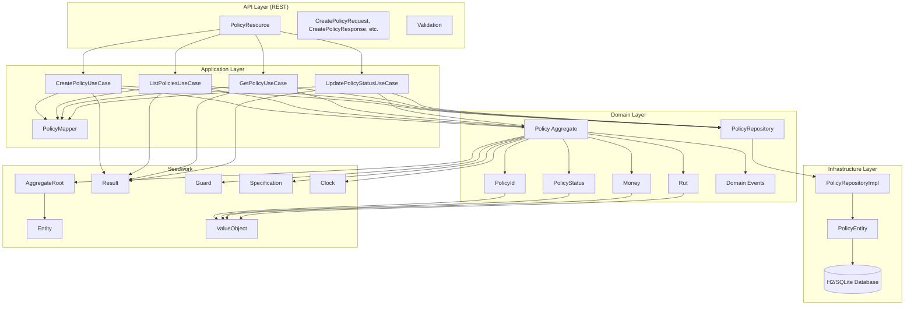
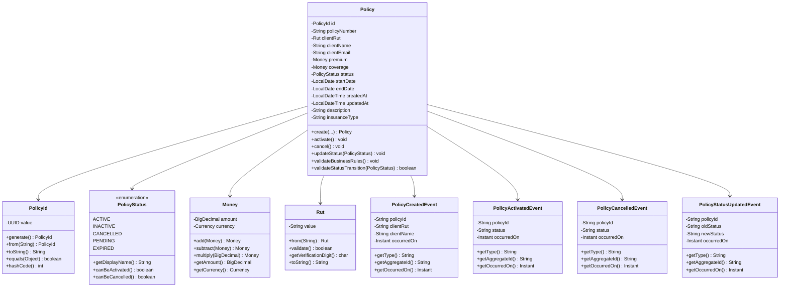
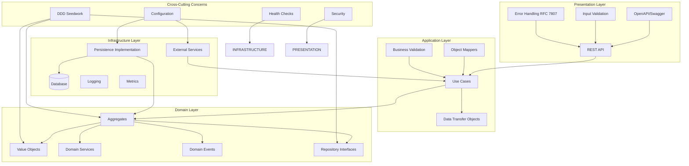
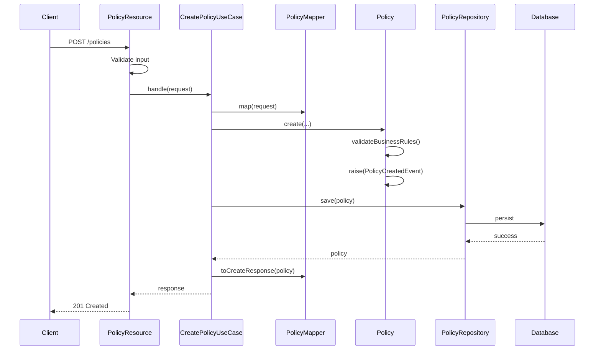
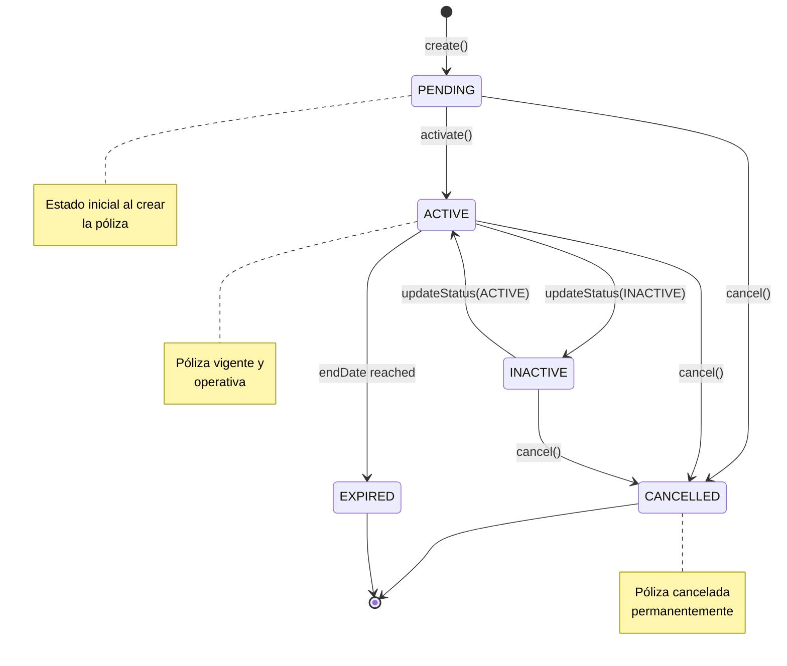
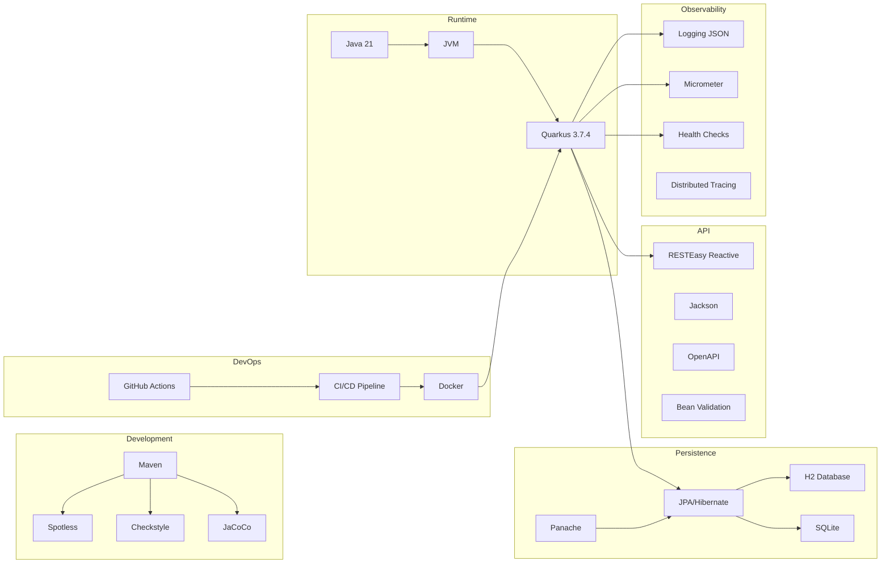
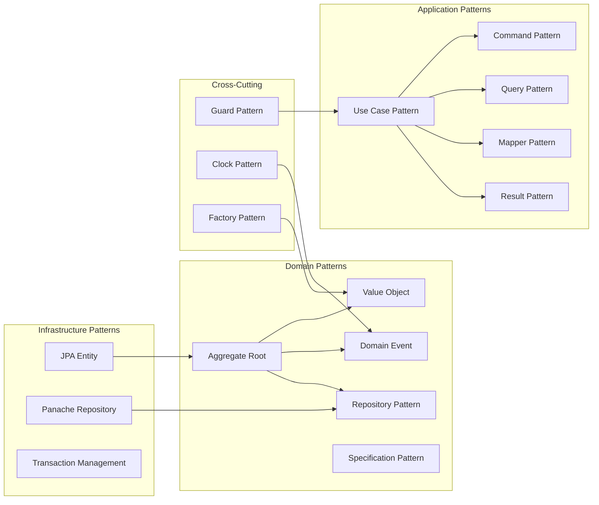
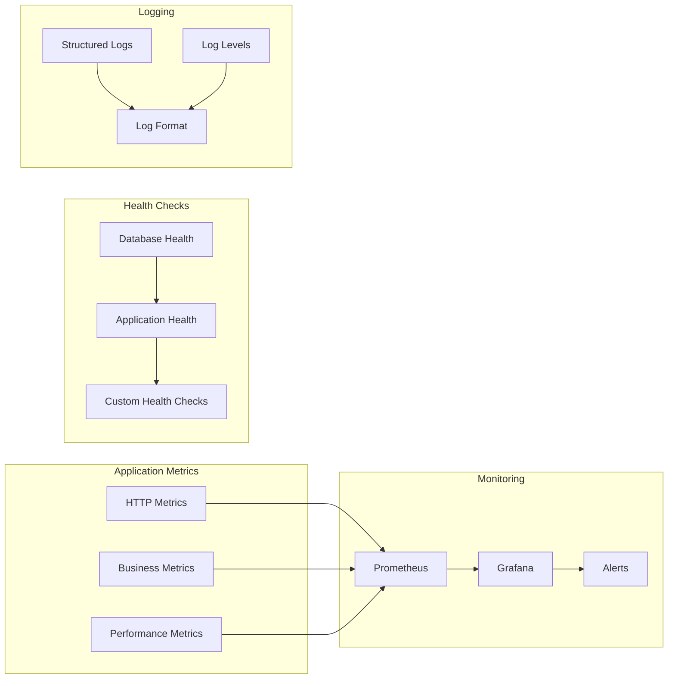
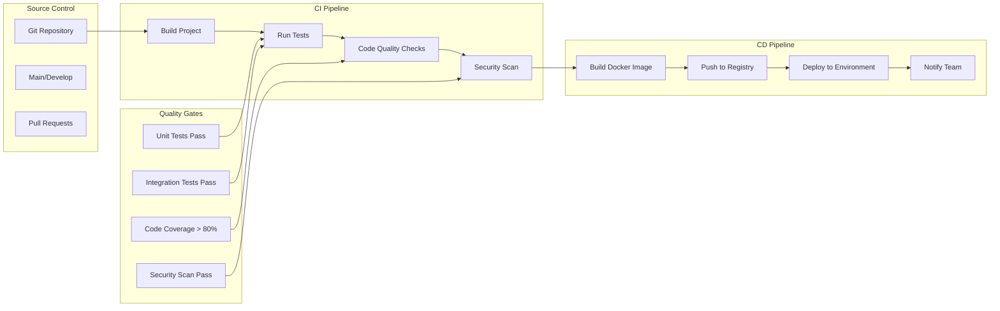

# Arquitectura de la Aplicación - Gestión de Pólizas

## Diagrama de Arquitectura General



## Diagrama del Modelo de Dominio



## Diagrama de Casos de Uso

```mermaid
graph LR
    subgraph "API Endpoints"
        POST[POST /policies]
        GET_ALL[GET /policies]
        GET_ONE[GET /policies/{id}]
        PUT_STATUS[PUT /policies/{id}/status]
    end
    
    subgraph "Use Cases"
        CREATE[CreatePolicyUseCase]
        LIST[ListPoliciesUseCase]
        GET[GetPolicyUseCase]
        UPDATE_STATUS[UpdatePolicyStatusUseCase]
    end
    
    subgraph "Domain Operations"
        VALIDATE[Validate Business Rules]
        PERSIST[Persist Policy]
        RETRIEVE[Retrieve Policy]
        UPDATE[Update Status]
        EVENTS[Raise Domain Events]
    end
    
    POST --> CREATE
    GET_ALL --> LIST
    GET_ONE --> GET
    PUT_STATUS --> UPDATE_STATUS
    
    CREATE --> VALIDATE
    CREATE --> PERSIST
    CREATE --> EVENTS
    
    LIST --> RETRIEVE
    GET --> RETRIEVE
    
    UPDATE_STATUS --> VALIDATE
    UPDATE_STATUS --> UPDATE
    UPDATE_STATUS --> EVENTS
```

## Diagrama de Capas de Arquitectura



## Diagrama de Flujo de Creación de Póliza



## Diagrama de Estados de Póliza



## Tecnologías y Stack



## Estructura de Directorios

```mermaid
graph TD
    ROOT[polizas-service/]
    
    subgraph "Source Code"
        MAIN[src/main/java/cl/demo/polizas/]
        MAIN --> SEEDWORK[seedwork/]
        MAIN --> DOMAIN[domain/]
        MAIN --> APPLICATION[application/]
        MAIN --> APP[app/]
        
        SEEDWORK --> SEED_DOMAIN[domain/]
        SEEDWORK --> SEED_APP[application/]
        SEEDWORK --> SEED_INFRA[infrastructure/]
        
        DOMAIN --> DOMAIN_MODEL[model/]
        DOMAIN --> DOMAIN_VO[valueobject/]
        DOMAIN --> DOMAIN_REPO[repository/]
        DOMAIN --> DOMAIN_SERVICE[service/]
        DOMAIN --> DOMAIN_EVENTS[events/]
        
        APPLICATION --> APP_USECASE[usecase/]
        APPLICATION --> APP_DTO[dto/]
        
        APP --> APP_CONFIG[config/]
        APP --> APP_REST[rest/]
        APP --> APP_PERSIST[persistence/]
        APP --> APP_MAPPERS[mappers/]
        APP --> APP_VALID[validation/]
    end
    
    subgraph "Resources"
        RESOURCES[src/main/resources/]
        RESOURCES --> APP_PROPS[application.properties]
        RESOURCES --> APP_SQLITE[application-sqlite.properties]
    end
    
    subgraph "Tests"
        TEST[src/test/java/cl/demo/polizas/]
        TEST --> TEST_DOMAIN[domain/]
        TEST --> TEST_APPLICATION[application/]
        TEST --> TEST_APP[app/rest/]
    end
    
    subgraph "Configuration"
        CONFIG[pom.xml]
        CONFIG --> SPOTLESS_CONFIG[spotless.xml]
        CONFIG --> CHECKSTYLE_CONFIG[checkstyle.xml]
        CONFIG --> DOCKERFILE[Dockerfile]
        CONFIG --> DOCKER_COMPOSE[docker-compose.yml]
    end
    
    ROOT --> MAIN
    ROOT --> RESOURCES
    ROOT --> TEST
    ROOT --> CONFIG
```



## Patrones de Diseño Implementados



## Métricas y Observabilidad



## Pipeline de CI/CD



## Resumen de Arquitectura

La aplicación sigue los principios de **Clean Architecture** y **Domain-Driven Design (DDD)**:

### Capas Principales:
1. **Domain Layer**: Contiene la lógica de negocio, entidades, value objects y reglas de dominio
2. **Application Layer**: Orquesta los casos de uso y coordina entre capas
3. **Infrastructure Layer**: Implementa la persistencia y servicios externos
4. **Presentation Layer**: Expone la API REST y maneja la validación de entrada

### Patrones Clave:
- **Aggregate Root**: `Policy` como raíz de agregado
- **Value Objects**: `PolicyId`, `PolicyStatus`, `Money`, `Rut`
- **Repository Pattern**: Abstracción de persistencia
- **Use Case Pattern**: Separación de responsabilidades por caso de uso
- **Domain Events**: Eventos de dominio para desacoplamiento

### Tecnologías:
- **Java 21** con **Quarkus 3.7.4**
- **H2/SQLite** para persistencia
- **JPA/Hibernate** con **Panache**
- **RESTEasy Reactive** para API REST
- **Maven** para build y gestión de dependencias

### Calidad de Código:
- **Spotless** para formateo
- **Checkstyle** para estándares de código
- **JaCoCo** para cobertura de pruebas
- **GitHub Actions** para CI/CD
